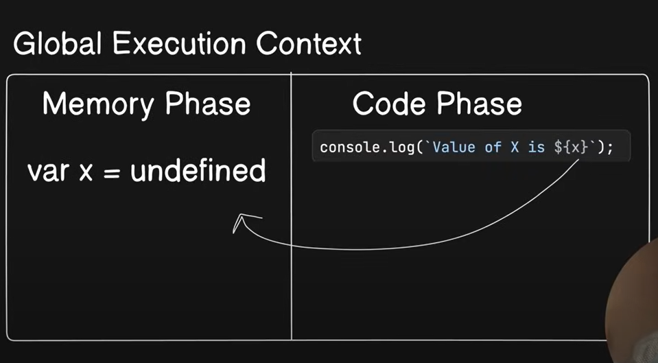
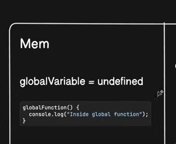
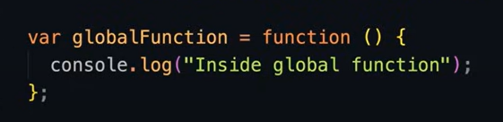

Interview questions 

## Hoistin

only for variables this happens like the undefined 
if fucniton is called lts entore body is in mem phase

and for each funtion its own global execurition context is created with its own mem and code phase

but if we createe a function like this it wont load as we are creating a variable again

if we use let or const we cant use before declareation

this means var - can be hoisted

## Temporal dead zone TDZ

let adn const create this while hoisting

it marks the zone before initialisation of variable and gives exception when called 
