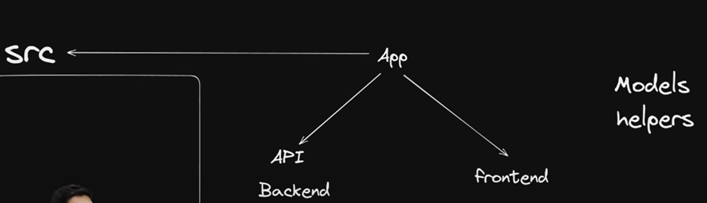

## Nextjs

Frontend and backend is in the app folder 
here is the folder structure

Here naming is very important whenever we create a components in frontend named login for eg then the frontend page must be named page.tsx or else there will be lot of errors

Inorder to make a client component all we need to do is "use client" at the top of the page
because by default all the components in nextjs are server components

In mongodb everything is lowercased and pluralized